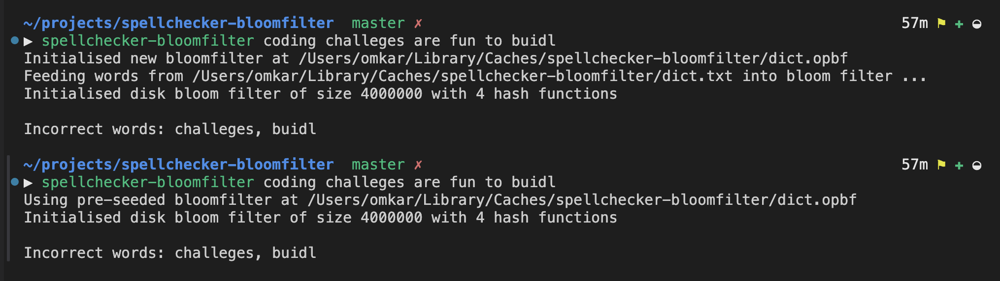
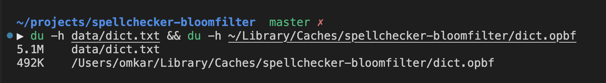
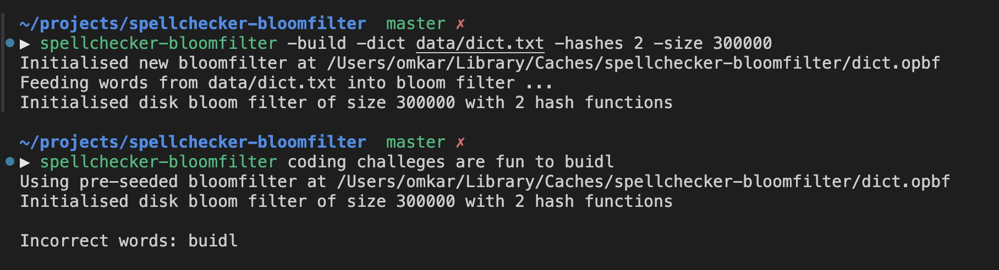

## A Bloomfilter powered Spell checker implemented in golang

Inspired from [Coding Challenges - Build Your Own Spell Checker Using A Bloom Filter
](https://codingchallenges.fyi/challenges/challenge-bloom/)

## Prerequisites

- Go 1.22 or later

## Try out

```bash
# Using brew (for mac or linux)
brew install omkarph/tap/spellchecker-bloomfilter
spellchecker-bloomfilter some correct and smoe incorrct wrods

# or

# Using a release archive from https://github.com/OmkarPh/spellchecker-bloomfilter/releases/latest
cd ~/Downloads # Go to the Downloads folder of your machine
mkdir spellchecker-bloomfilter
tar -xf "release_archive_file" -C spellchecker-bloomfilter
cd spellchecker-bloomfilter
./spellchecker-bloomfilter some correct and smoe incorrct wrods

```

## Usage

- Check words `spellchecker-bloomfilter coding challeges are fun to buidl`
- Seed your own dictionary
  
  `spellchecker-bloomfilter -dict ~/projects/spellchecker-bloomfilter/dict.txt`

- Rebuild bloom filter `-build`
  - Customise number of hash functions & size of bloom filter.
     Note - Size refers to number of bits used on disk for filter.
    
    `spellchecker-bloomfilter -build -hashes 3 -size 5200000`

  - With own dictionary

    `spellchecker-bloomfilter -build -dict data/dict.txt -hashes 3 -size 5200000` (With custom dictionary)


## How it works

- Refer 

- Calculation
  
  Target Index => MurmurHash(key) % FilterSize

  Target Byte => Target Index / 8

  Target Bit within Target byte => Target Index % 8

  Note - Header offset is added to byte idx, as per format used for storing on disk

- Format of `dict.opbf`(Generated and saved in your [Cache](https://pkg.go.dev/os#UserCacheDir) directory to store Bloomfilter data)

  ```bash
  OPBF file Format
  ▶ xxd -l 64 dict.opbf 
  00000000: 4f50 4246 0001 0000 0004 90d4 cc23 1652  OPBF.........#.R
  00000010: 7498 e7c7 064c 6c7d 8a77 003d 0900 a763  t....Ll}.w.=...c
  00000020: 44a1 32e5 644c 0e46 1492 a190 c538 e102  D.2.dL.F.....8..
  00000030: 4093 3210 7003 4955 0362 1076 3003 6014  @.2.p.IU.b.v0.`.

  First 4 bytes - Identifier ie. OPBF (4f50 4246)
  Next 2 bytes - Version ie. 1 (0001)
  Next 2 bytes - Case sensitivity ie. 0 (0000)
  Next 2 bytes - No. of Hash functions ie. 4 (0004)
  
  Next, 4 byte seed for every hash function 
  (90d4 cc23, 1652 7498, e7c7 064c, 6c7d 8a77)
  
  Next 4 bytes - Bloomfilter size (number of bits in filter)
  ie. 4000000 (003d 0900)

  Next 'Ceil(4000000/8)' bytes store the actual bloom filter
  ```
## Local setup

```bash
# Clone this repository
git clone https://github.com/OmkarPh/spellchecker-bloomfilter.git
cd spellchecker-bloomfilter

# Install dependencies
go get .

# Run
go run . some correct and smoe incorrct wrods

# Build release executible
go build -o build/spellchecker-bloomfilter

./build/spellchecker-bloomfilter coding challeges are fun to buidl
```

## Output



Size comparison - Plain dictionary text file vs OPBF file


Lesser Bloom filter size may lead to collisions and incorrect result

